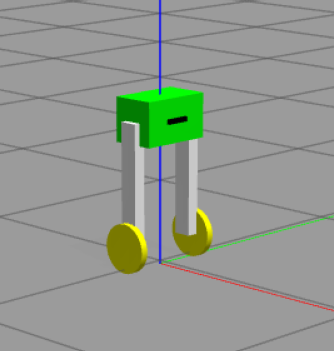

> [!NOTE]
>**1**
> **该项目环境为 `ubuntu 22.04 + ROS2 humble`**

需要安装：`gazebo_ros，xacro ，gazebo_ros2_control,ros2_control,ros2_controllers`功能包

安装命令为：

 

```
sudo apt-get install ros-humble-gazebo-ros-pkgs
```

```
sudo apt-get install ros-humble-xacro
```

```
sudo apt-get install ros-humble-gazebo-ros2-control 
```

```
sudo apt-get install ros-humble-ros2-control
```

```
sudo apt-get install ros-humble-ros2-controllers
```

该项目为我为了学习ros2_control与gazebo所写的，因为初学代码水平较低，请大家见谅，也欢迎大家提出修改意见。

> [!NOTE]
>**2**
>**食用方法：**

  1：新开一个终端，使用命令，刷新一下bash：

```
source install/setup.bash
```

  2: 使用命令：

```
ros2 launch robot_description_pkg robot_display.launch.py
```


  3: 新开另一个终端，使用命令：

```
ros2 run teleop_twist_keyboard teleop_twist_keyboard
```


  注意：如果出现无法编译的情况，请删除build install log 三个文件夹，再重新编译即可。
  

工程文件里面有一个`K_calc_matalb.m`的matlab代码和`k_calc_python.py`的python代码，运行其中一个可以求解控制平衡小车的k增益矩阵。

看到这里了，可以给我一个star吗
